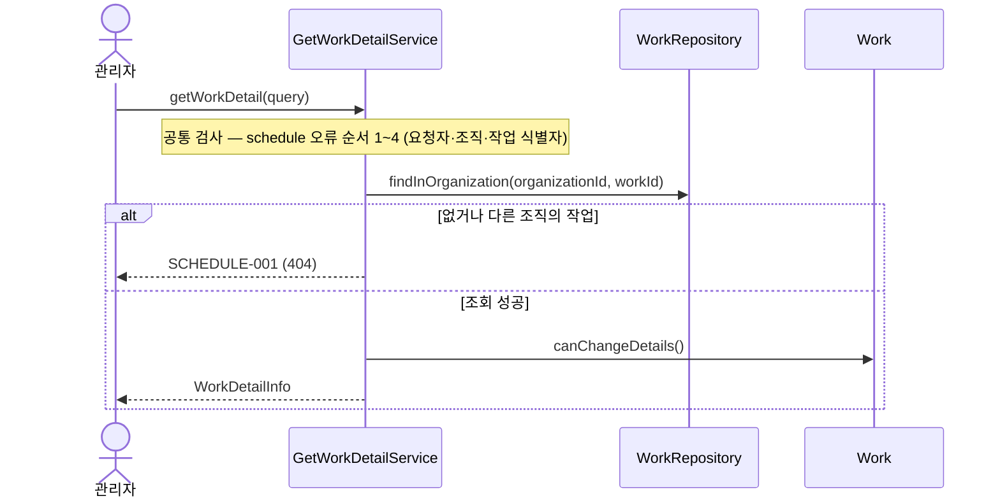

# PR 종류

사람은 PR의 코드 전체가 아니라 **핵심 다이어그램과 구현 내용 표**로 수용 여부를 판단합니다. 그래서 종류마다 판단 근거가 되는 산출물이 다릅니다. 한 PR에는 한 종류만 둡니다. 기계 판정은 [PR 규약 검사](../../../../.github/scripts/check_pr_metadata.py), 다이어그램과 코드의 일치는 [리뷰](../../dino-review/references/automation.md#규약-검사)가 확인합니다.

| 종류 | 정의 | 제목 type | 기능 명세 | 핵심 다이어그램 |
| --- | --- | --- | --- | --- |
| `유즈케이스` | 노션 기능 하나를 Web→Application→Domain→Adapter로 완결하는 수직 슬라이스. 필요한 도메인 모델·포트·어댑터를 함께 추가 | `feat` | 노션 링크 필수 | `sequenceDiagram` |
| `모듈 연동` | 새 공개 계약·이벤트·`allowedDependencies` 변경처럼 모듈 경계를 넘는 흐름 | `feat` | 노션 링크 필수 | 모듈을 참여자로 둔 `sequenceDiagram` |
| `호환성 변경` | 기존 스키마·API·이벤트 계약 변경. expand / migrate / contract 단계마다 PR 하나 | `feat`·`refactor`·`fix` (contract 단계는 `!`) | 링크 또는 `없음` | `erDiagram`·`classDiagram`·`flowchart`·`sequenceDiagram` 중 하나 |
| `구조 변경` | 외부 동작을 바꾸지 않는 리팩터링·성능 개선 | `refactor`·`perf` | `없음` | 변경 전후 `flowchart` 또는 `classDiagram` |
| `결함 수정` | 기대 동작·명세와 다른 결과를 바로잡음 | `fix` | 링크 또는 `없음` | 실패 경로를 표시한 `sequenceDiagram` |
| `유지보수` | 의존성·빌드·CI·문서·테스트 보강·되돌리기·조사 | `build`·`ci`·`docs`·`test`·`chore`·`revert`·`investigation` | `없음` | `없음` |

참고 근거: [Google Small CLs](https://google.github.io/eng-practices/review/developer/small-cls.html)(자기완결 변경·리팩터링 분리·수직 분할), [Vertical Slice](https://www.jimmybogard.com/vertical-slice-architecture/), [Parallel Change](https://martinfowler.com/bliki/ParallelChange.html), [Spring Modulith 모듈·테스트](https://docs.spring.io/spring-modulith/reference/fundamentals.html).

## 판별 순서

diff에서 위부터 처음 맞는 종류를 고릅니다. 두 종류가 동시에 맞으면 [나눕니다](planning.md#unit).

1. `src/main` 밖(문서·테스트·빌드·CI·의존성)만 바뀜 → `유지보수`. `src/main`의 외부 동작이 그대로이고 구조만 바뀜 → `구조 변경`
2. 합의된 동작과 다르던 결과를 고침 → `결함 수정`
3. 기존 소비자가 대응해야 하는 스키마·API·이벤트 변경 → `호환성 변경`
4. 모듈 루트 공개 타입·named interface·이벤트·`allowedDependencies`가 바뀜 → `모듈 연동`
5. 그 밖의 새 동작 → `유즈케이스`

## 절별 작성 기준

모든 종류가 같은 [양식](../../../../.github/pull_request_template.md)과 절 순서를 씁니다. 해당 없는 필수 절은 `없음`으로 적습니다.

- **기능 명세:** 노션 기능명세 링크와 대상 절·기능명(예: `[작업] 기능명세 v1.1 §4 상세 조회`). 권한·제한처럼 정책서가 정한 규칙을 구현했으면 정책서 절도 함께 적습니다(예: `[작업] 정책 v1.1 §10`). 명세 내용을 복사하지 않습니다. 모듈별 페이지는 [기획 원본 색인](../../../../docs/planning/README.md#baseline)에서 찾습니다.
- **핵심 다이어그램:** `mermaid` 코드 블록. 사람이 GitHub 화면 폭에서 글자를 읽을 수 있어야 합니다.
  - 참여자는 **5개 이하**로, 계층 경계 단위(호출자·UseCase 서비스·출력 포트·도메인·다른 모듈)로 둡니다. 같은 패키지의 내부 헬퍼·DTO 변환은 참여자로 두지 않고 해당 호출 메시지에 합칩니다.
  - 실제 클래스·메서드 이름을 쓰되 메시지·간선 라벨은 메서드 이름이나 몇 단어로 쓰고 코드 식을 넣지 않습니다.
  - 모듈 공통 규칙(예: schedule 공통 오류 순서)은 `Note` 한 줄로 요약하고, **이 기능에만 있는 분기**만 `alt`로 그립니다.
  - 한 PR에 3개 이내이며 넘으면 나눌 신호입니다.
- **구현 내용:** 아래 종류별 표. 한 행은 한 규칙이고 근거 테스트를 연결합니다. 근거 테스트가 대부분 한 클래스면 열 제목에 클래스를 한 번 쓰고(`근거 테스트 (GetWorkDetailServiceTest)`) 셀에는 `#메서드`만 적습니다. 셀은 한 줄로 쓰고 행은 10개 이내로 묶습니다. 마지막 `차이` 열에는 `-` 또는 `1`처럼 번호만 적고(열 제목·값이 길면 표가 찌그러짐), 설명은 표 아래 `명세와 차이` 번호 목록에 한 항목씩 둡니다.
- **기술적 선택:** 리뷰어가 동의해야 하는 선택만 `선택 / 이유 / 검토한 대안`으로 적습니다. 컨벤션을 그대로 따른 것은 적지 않습니다.
- **리뷰 포인트:** 다이어그램으로 설명되지 않아 사람이 코드를 직접 봐야 하는 위치(`경로:줄`)와 이유. 없으면 절을 지웁니다.

### 유즈케이스

| 비즈니스 규칙 | 근거 테스트 (GetWorkDetailServiceTest) | 차이 |
| --- | --- | --- |
| 다른 조직의 작업은 존재를 숨긴다(404) | `#hidesWorkOfOtherOrganization` | - |

정상 흐름과 이 기능에만 있는 실패 분기를 `alt`로 보이고, 모듈 공통 검사는 `Note over`로 한 줄 요약합니다. 트랜잭션·이벤트 발행·잠금이 있으면 그 경계를 `Note` 또는 `rect`로 표시합니다.

### 모듈 연동

참여자를 모듈(`participant schedule`, `participant organization`)로 두고 공개 인터페이스 호출·이벤트 발행/소비를 그립니다. 구현 내용 표는 `제공·필요 인터페이스 | 변경 | 소비자 | 근거 테스트(ModularityTest, @ApplicationModuleTest, Scenario)`입니다. 구현 후 `module-reviewer` 검토 결과를 리뷰 포인트에 요약합니다.

### 호환성 변경

변경 전후 계약을 `erDiagram`(스키마)·`classDiagram`(타입) 등으로 보이고, 구현 내용 표는 `단계(expand/migrate/contract) | 바뀌는 계약 | 기존 소비자 영향 | 적용·복구 순서 | 근거 테스트`입니다. contract 단계만 `!`와 `compatibility:breaking` 라벨을 붙입니다.

### 구조 변경

변경 전후 의존 관계를 `**변경 전**`, `**변경 후**` 라벨 아래 `flowchart LR` 블록 두 개로 나눠 그립니다. 한 블록에 subgraph 두 개를 두면 렌더링 순서가 뒤바뀔 수 있습니다. 타입 구조가 핵심이면 `classDiagram`을 씁니다. 구현 내용 표는 `보존한 계약 | 근거(수정 없이 통과한 기존 테스트)`이며 테스트 기대값을 바꿨다면 구조 변경이 아닙니다.

### 결함 수정

실패하던 경로를 `sequenceDiagram`으로 그리고 원인 지점에 `Note over`로 표시합니다. 구현 내용 표는 `발생 조건 | 원인 | 수정 후 결과 | 재현 테스트(실패→성공)`입니다.

### 유지보수

핵심 다이어그램은 `없음`. 구현 내용에 `대상 | 목적 | 영향 | 확인 결과`를 적습니다. 의존성 업그레이드는 변경 버전과 릴리스 노트의 영향 항목만 적습니다.
